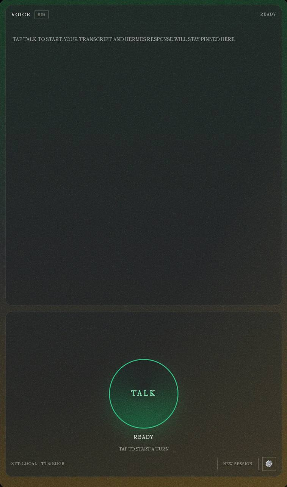
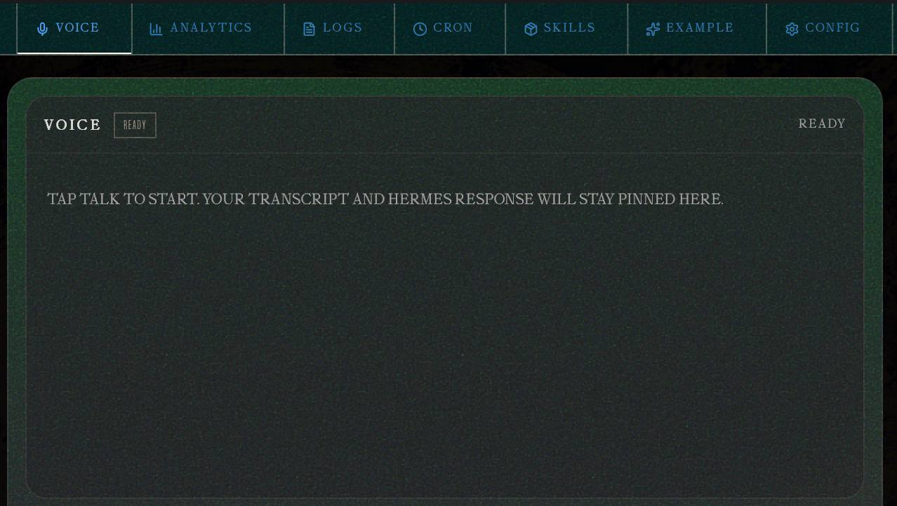
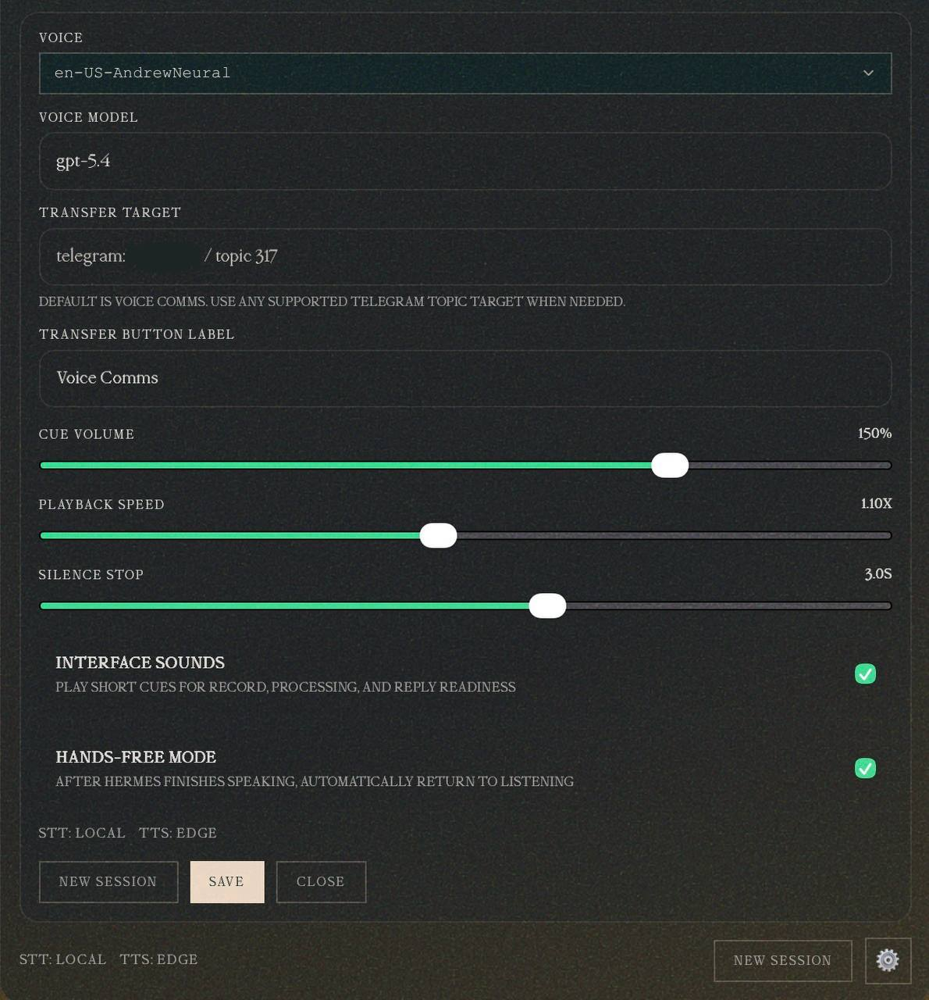

# Hermes Voice Plugin

A standalone Hermes dashboard plugin that adds mobile-first browser voice chat with persistent conversation context and one-tap transfer into Telegram or any Hermes `send_message` target.

## Features

- browser mic capture and voice response playback
- persistent voice sessions across turns
- replay last answer
- explicit `New session` reset control
- transfer current exchange into Telegram or another Hermes messaging target
- clean single-surface response UI for thinking vs final text

## Install

### From GitHub

```bash
hermes plugins install <owner>/hermes-voice-chat-plugin --enable
hermes gateway restart
```

Then open the Hermes dashboard and click the **Voice** tab.

## Screenshots

### Main voice UI



### Dashboard ribbon with Voice tab



### Voice customization panel



### From a local clone

```bash
hermes plugins install file:///absolute/path/to/hermes-voice-chat-plugin --enable
hermes gateway restart
```

## Plugin layout

```text
plugin.yaml
__init__.py
dashboard/
  manifest.json
  plugin_api.py
  dist/
    index.js
    style.css
```

## Configuration

The plugin stores runtime settings under:

```text
$HERMES_HOME/voice-plugin/settings.json
```

Important settings:

- `voice`
- `model_override`
- `hands_free`
- `silence_seconds`
- `transfer_label`
- `transfer_target`

## Transfer targets

The transfer button uses Hermes target specs, for example:

- `telegram:-1001234567890:17585`
- `discord:#bot-home`
- `slack:#engineering`

Change the transfer target in the Voice settings panel before using the handoff button.

## Requirements

- Hermes with dashboard plugin support
- running Hermes gateway/dashboard
- browser microphone permission
- a configured model provider for normal Hermes conversations
- TTS provider support already configured in Hermes if you want spoken playback

## Notes for maintainers

This repository is shaped so Hermes can install it directly with `hermes plugins install`. The root directory is the plugin directory that gets cloned into `~/.hermes/plugins/voice/`.
